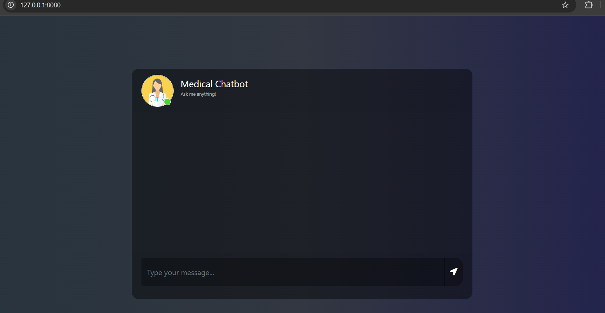
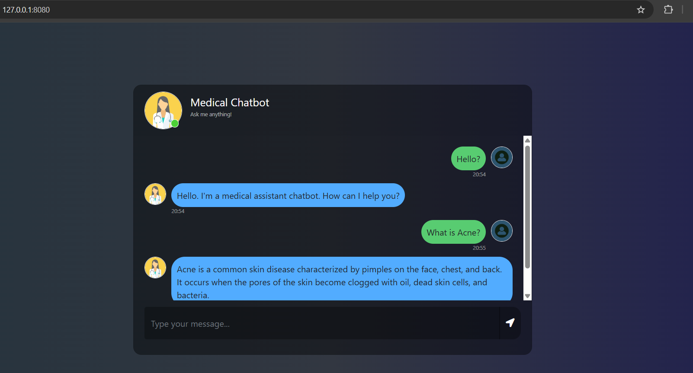

# rag-medical-assistant

# How to run?
### STEPS:

Clone the repository

```bash
git clone https://github.com/Arjitshukla/rag-medical-assistant.git
```
### STEP 01- Create a conda environment after opening the repository

```bash
conda create -n .venv python=3.10 -y
```

```bash
conda activate .venv
```


### STEP 02- install the requirements
```bash
pip install -r requirements.txt
```


### Create a `.env` file in the root directory follows:

```ini
GROQ_API_KEY="*************************"
MODEL_NAME="*******************"
```


```bash
# run the following command to store embeddings to pinecone
python store_index.py
```

```bash
# Finally run the following command
python app.py
```

Now,
```bash
open up localhost: http://127.0.0.1:8080/
```
## Images






### Techstack Used:

- Python
- Rag
- LangChain
- Flask
- Groq secrete key ==> free llm 
- FAISS
